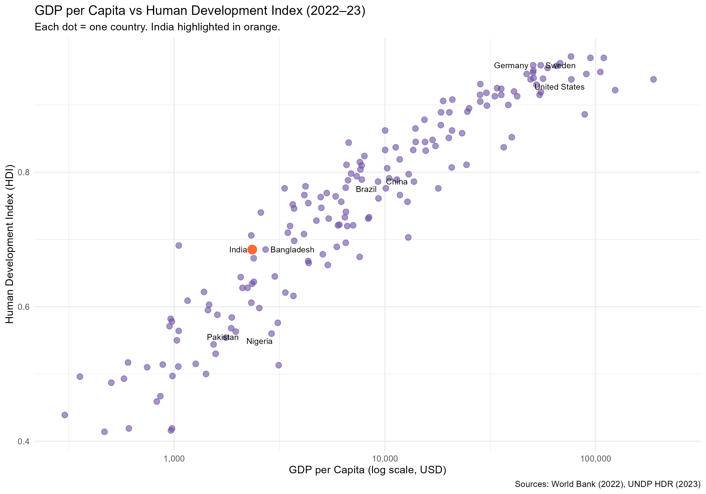

# gdp-hdi-development-analysis
# GDP per Capita vs Human Development Index 🌍

A data analysis project exploring the relationship between 
economic output and human development across 169 countries.

## Key Question
Does higher GDP always mean better human development? 
Spoiler: not always.

## What I Found
- There is a strong positive relationship between GDP per capita 
  and HDI globally — but it's not linear
- **India** underperforms relative to its GDP, sitting at a lower 
  HDI than expected for its income level
- **Bangladesh** achieves comparable HDI to India at lower GDP — 
  suggesting efficient social spending matters more than raw wealth
- Nordic countries like Sweden and Germany show that beyond ~$40,000 
  GDP per capita, HDI gains flatten significantly
- Money matters more for human development at LOW incomes than high ones

## Data Sources
- GDP per Capita: [World Bank Open Data](https://data.worldbank.org) (2022)
- Human Development Index: [UNDP Human Development Report](https://hdr.undp.org) (2023)

## Tools Used
- R
- tidyverse
- readxl
- ggplot2
- ggrepel

## Plot

## Note
One country was excluded due to missing data (169 of 170 countries retained)
